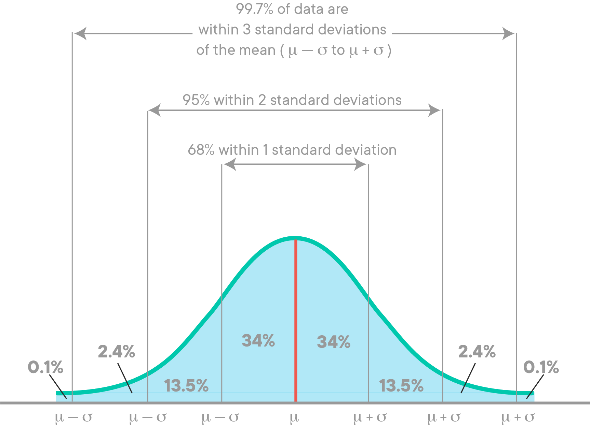

# Hypothesis Testing - Guided Practice

- ds-flex 


# 📚Hypothesis Testing Steps


## Overview

1. State the null hypothesis ($H_0$) and the alternative hypothesis ($H_A$ or $H_1$)


2. Determine the correct test to perform.
    - What test is appropriate for your hypothesis?
    - What value should we use for $\alpha$? (e.g.: .05, .01,.001 ?)
    
    
3. Prepare the data and perform the selected test. 

4. Interpret the resulting p-value (reject or fail to reject the null hypothesis) 

5. Perform posthoc tests (if necessary)

### STEP 1: State Your Hypothesis & Null Hypothesis 

- **Before selecting the correct hypothesis test, you must first officially state your null hypothesis ($H_0$) and alternative hypothesis ($H_A$ or $H_1$)**


- **Before stating your hypotheses, ask yourself:**
    1. What question am I attempting to answer?
    2. What metric/value am I measuring to answer this question?
    3. Do I expect the groups to be different in a specific way? (i.e. one group greater than the other).
        - Or do I just think they'll be different, but don't know how?


### STEP 2: Determine the correct test for the data/hypothesis

<!-- based on data type and # of samples/groups -->

#### Q1: What type of data am I measuring? Is it numeric or categorical?


#### Q2: How many groups/samples am I comparing?
- One group vs a known value?
- Two groups?
- More than two groups?


#### Using the answers to the above 2 questions: select the type of test from this table.

|*What type of comparison?* | Numeric Data | Categorical Data|
| --- | --- | --- |
|**1 Sample vs Known Quantity/Target**|1 Sample T-Test| Binomial Test|
|**2 Samples** | 2 Sample T-Test| Chi-Square|
|**More than 2**| ANOVA and/or Tukey | Chi Square|


#### What probability will we use as our significance cutoff?

- Set your $\alpha$ level (typically $\alpha$ =.05)
    - How rare should the value be before we consider it to be an outlier/statistically significantly different?




### STEP 3: Perform the test

#### Hypothesis Testing Functions

```python
from scipy import stats
```

| Hypothesis test|Scipy Function | 
 | --- | --- |
 | **1-sample t-test** |`stats.ttest_1samp()`|
 | **2-sample t-test** |`stats.ttest_ind()` | 
 | **One-Way ANOVA** | `stats.f_oneway()` | 
 | **Binomial test** |`stats.binom_test()` |
 | **Chi-Square test** | `stats.chi2_contingency()`|
 
 

- **Perform the test to get your test-statistic and the associated p-value.**

### STEP 4: Interpret the test result and perform any post-hoc test


#### Interpret your p-value compared to $\alpha$


- **If p > $\alpha$:**:
    - We fail to reject the null hypothesis.
        - The observed difference likely occurred due to random chance, not do to the effect we were analyzing.
        - We have essentially disproved our hypothesis.
    - The result is not significant.
    
    
- **If p is < $\alpha$:**
    - We reject the null hypothesis. 
        - The observed difference was most likely NOT due to random chance.
        - We have "supported" our hypothesis. (we NEVER "prove" our hypothesis)
    - The result is significant.


#### Next Steps 
- **If we did not have significant results:**
    - We are done! Write up the final answer. 
    
- **If we had significant results:**

    - If there are 2 groups:
        - Use a visualization to confirm which group had the larger/smaller value. (e.g. a barplot).
        - Calculate effect size (e.g. Cohen's $d$)
        - Write up the final answer.

    - If there are >2 groups:
        - Run a pairwise multiple-comparison test (e.g. Tukey's test) to determine which groups were different.
            - [Tukey pairwise comparison test](https://www.statsmodels.org/stable/generated/statsmodels.stats.multicomp.pairwise_tukeyhsd.html) (`statsmodels.stats.multicomp.pairwise_tukeyhsd`)


- Report statistical power (optional)

#### Post-Hoc Functions:

| Post-Hoc Tests/Calculatons|Function|
|--- | --- |
|**Tukey's Pairwise Comparisons** | `statsmodels.stats.multicomp.pairwise_tukeyhsd`|
|**Effect Size**| `Cohens_d`|
|**Statistical Power** | `statsmodels.stats.power`:<br>  `TTestIndPower` , `TTestPower`

## Resources 

- See the included [Hypothesis Testing Slide Deck](https://github.com/flatiron-school/ds-flex-hypothesis-testing-guided-practice/blob/main/resources/Hypothesis%20Testing%20with%20SciPy_codeacademy%20slides.pdf) for a recap of the process.

- See the included [Hypothesis Testing with Scipy Cheatsheet](https://github.com/flatiron-school/ds-flex-hypothesis-testing-guided-practice/blob/main/resources/hypothesis-testing-with-scipy%20cheatsheet.pdf)

- Both are also included in the `resources` folder, as well

# 🕹Activity: Hypothesis Testing with Insurance Data


```python
## import the standard packages
import pandas as pd
import numpy as np
import seaborn as sns
import matplotlib.pyplot as plt


## import hypothesis testing functions
from scipy import stats

import statsmodels.api as sm
import statsmodels.formula.api as smf


%load_ext autoreload
%autoreload 2
import functions as fn
```

## US Health Insurance Dataset

- https://www.kaggle.com/teertha/ushealthinsurancedataset


```python
# Load in the insurance.csv in the data folder and display preview
df = pd.read_csv("data/insurance.csv")
display(df.head())
df.info()
```

### Questions to Answer

>- Q1. Do smokers have higher insurance charges than non-smokers?
>- Q2. Are women and men equally likely to be smokers?
>- Q3. Do different regions have different charges, on average?
>- [Level Up]: Q4: Do insurance companies charge smokers vs non-smokers different amounts for men vs women?

## Q1: Do smokers have higher insurance charges than non-smokers?

#### Formally State the Hypothesis

- $H_1$ : 

- $H_0$ : 

#### Determine the Correct Statistical Test 

- Q1: What type of data are we comparing?
    - A:
    
    
- Q2: How many samples/groups are being compared?
    - A: 
    
    
- Therefore, the correct test to perform would be:
    - A:


```python
## let's visualize the distribution of charges for smokers and non-smokers

```


```python
## let's visualize the average charges for smokers and non-smokers

```


```python
## save all charges for smokers in a new smokers variable

```


```python
## now do the same for the non-smokers

```


```python
## Run the correct hypothesis test from scipy

```


```python
## interpret the p-value 

```


```python
# is the result significant?

```


```python
# HOW significant? (<.01? <.001?? <.000000001???)

```


```python
## calcualte the effect size using cohen's d

```

### Conclusion/Interpretation


```python
## Make a barplot of the average charges for smokers vs non-smokers

```

>- `Conclusion goes here.`

## Q2: Are women and men equally likely to be smokers?

#### Formally State the Hypothesis
- $H_1$ :

- $H_0$ :

#### Determine the Correct Statistical Test 

- Q1: What type of data are we comparing?
    - A: 
    
    
- Q2: How many samples/groups are being compared?
    - A: 
    
    
- Therefore, the correct test to perform would be:
    - A: 


```python
## Visualize the # of smokers by sex

```


```python
## Get contingency table for smoker x sex using pd.crosstab

```


```python
## perform the correct test for the hypothesis

```


```python
## interpret the p-value 

```


```python
# is the result significant?

```


```python
# HOW significant? (<.01? <.001?? <.000000001???)

```

### Conclusion/Interpretation


```python
# get the contigency table again, but normalzie it by sex

```

>- `Conclusion goes here.`

## Q3: Do different regions have different insurance charges?

#### Formally State the Hypothesis
- $H_1$ : 
- $H_0$ : 

#### Determine the Correct Statistical Test 

- Q1: What type of data are we comparing?
    - A:
    
    
- Q2: How many samples/groups are being compared?
    - A: 
    
- Therefore, the correct test to perform would be:
    - A:


```python
## visualize the regions vs charges

```

### Performing the ANOVA with `scipy`


```python
## separate the data into groups
groups = {}


    ## Get series for group and rename

    # save into the dictionary


## check what keys are in the groups dict

```


```python
# perform the correct hypothesis test
# method 1 - manual slicing 

```


```python
# perform the correct hypothesis test
# method 2 - using * to unpack

```


```python
## interpret the p-value 

```


```python
# is the result significant?

```


```python
# HOW significant? (<.01? <.001?? <.000000001???)

```

### Perform ANOVA with `statsmodels`


```python
## Create a formula to explain charges using the category of "region"


## Make and fit an ols model 


# Use statsmodels anova_lm function with the model 

```

### Posthoc Multiple Comparison Test: Determine which pairs of groups were different


```python
from statsmodels.stats.multicomp import pairwise_tukeyhsd
## save the charges column as values and the region as labels
values =  None
labels = None
```


```python
## perform tukey's multiple comparison test and display the summary

```

### Conclusion/Interpretation


```python
## Make a barplot using ci=68 (Standard Error of the Mean)

```

>- `Conclusion goes here.`

## [Level Up]: Q4: Do insurance companies charge smokers vs non-smokers different amounts for men vs women?

#### Formally State the Hypothesis
- $H_1$ : 
- $H_0$ : 

#### Determine the Correct Statistical Test 

- Q1: What type of data are we comparing?
    - A:
    
    
- Q2: How many samples/groups are being compared?
    - A: 
    
    
<!-- - Therefore, the correct test to perform would be...??? -->


<details>
    <summary style='font-weight:bold;'>> Therefore, the correct test to perform would be... (click to expand) </summary>
   <ul>
       <li style="font-weight:bold;">A: Two-Way ANOVA!  https://www.statology.org/two-way-anova-python/</li>
    </ul>
</details>


```python
## Visualzie the average charges for smokers vs non-smokers, separated by sex

```


```python
## Make the formula to explain charges with the categories of smoker and sex
f = ""
model = None

## Calculate the two-way anova using your model
results = None
results
```


```python
## interpret the p-value for smokers
p_smoker = None

```


```python
## is the p-value for smoker significant?

```


```python
##HOW significant?

```


```python
## interpret the p-value for sex
p_sex = None

```


```python
## is the p-value for sex significant?

```

### Conclusion


```python
## Visualzie the average charges for males vs females, separated by smokers

```

>- `Conclusion goes here.`

# Conclusion/Recap

- Today we walked through testing several hypothesis that required different statistical tests. 
- We walked through setting our hypothesis and null hypothesis.
- We then selected the right test based upon the type of data we were using and how many groups we were comparing. 

- We performed the chosen test, interpreted the p-value, and performed posthoc tests as needed.


- We learned that there are more advanced statistical tests than what is included in the curriculum.


# APPENDIX

## Your Turn! Think of another Hypothesis to test.

- example: Is our sample's BMI representative of the the national average BMI? (See the pdf in the data folder for the stats)

#### Formally State the Hypothesis
- $H_1$ :
- $H_0$ : 

#### Determine the Correct Statistical Test 

- Q1: What type of data are we comparing?
    - A: |
    
    
- Q2: How many samples/groups are being compared?
    - A: 
    
    
- Therefore, the correct test to perform would be:
    - A:


```python

```
